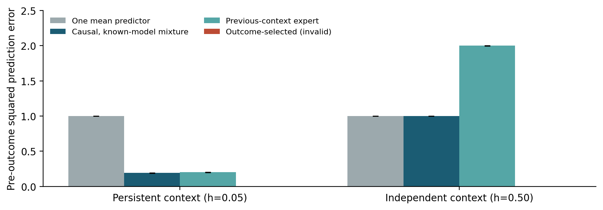

# When Should a Learner Split?

**Responsibility, interference, and evidence for structural specialization**

Antti Luode - research note v0.1, 7 September 2026. AI-assisted draft, not peer reviewed.

**[Read the paper (PDF)](output/pdf/when_should_a_learner_split.pdf)** · **[Read on GitHub](paper/paper.md)** · **[Prospective experiment](PROTOCOL.md)**

When conflicting experience arrives, should a learner revise an existing model, retrieve another model, investigate, or create a new specialization?

This manuscript develops that question from the JelloBrain experiments and the supplied Sol/Astra discussion. It positions the idea against established work on paired predictive/control models, latent-cause inference, expandable networks, continual mixtures, and gradient interference.

The paper makes a deliberately bounded contribution: a reproduced interference diagnostic, mathematical counterexamples, executable timing controls, and a specified future growth experiment. **It does not claim a new growing-agent algorithm, solved continual learning, biological equivalence, or consciousness.**

## Results actually executed for this paper

- **JelloBrain cross-write diagnostic:** rerun unchanged at twelve seeds, 400 training writes per route. The shared sheet's collateral/self-effect ratio is **1.00337**. Independent bands have exactly zero cross-band effect by construction and consume additional memory.
- **Measured effect-vector angle:** **179.807 degrees** between columns of the mean cross-write matrix. This is not a parameter-gradient angle or a proof that growth is necessary.
- **Causal timing control:** 64 seeded streams of 20,000 trials per condition. The causal, known-model mixture attains MSE **0.19046** in persistent contexts and **1.00000** in independent contexts. An invalid selector using the current outcome reports zero in both.
- **Noise control:** at a fixed mean predictor, opposing consecutive sample gradients occur about ten times more often in the unpredictable condition. Conflict alone does not justify a new predictively selectable context.
- **Coordinate control:** invertible parameter scaling changes a gradient cosine from **-0.6** to **+0.384615** without changing the represented functions.

The manuscript also discusses later exploratory JelloBrain reversal reports. Those reports are pinned and archived but were **not rerun** here. The distinction is recorded in [EVIDENCE.md](EVIDENCE.md).



## Reproduce

Python 3.12 was used. The exact direct dependency versions are in [requirements-lock.txt](requirements-lock.txt); broader supported ranges are in [requirements.txt](requirements.txt). Fonts used by the PDF generator ship with Matplotlib.

```bash
python -m pip install -r requirements-lock.txt
python vendor/jellobrain/crosstalk_probe.py > results/jellobrain_cross_write.json
python analysis/run_analysis.py
python analysis/check.py
python analysis/build_pdf.py
```

The first command after installation reruns the slower substrate experiment. The other commands can also run against the committed raw receipt. `analysis/run_analysis.py` regenerates the figures and full per-seed numerical record. Tests include a direct attack on causal timing: changing the current and all future outcomes must leave the already due predictions unchanged.

The PDF is generated from [paper/paper.md](paper/paper.md) using ReportLab; it includes embedded fonts, equation images, clickable references, bookmarks, and page numbers. Standard scientific figures are available as both PNG and vector PDF. For a TeX-based submission workflow, the Markdown math can be converted with Pandoc; this repository's authoritative rendered version is the committed PDF.

## Files

| File or directory | Purpose |
| --- | --- |
| [paper/paper.md](paper/paper.md) | Complete manuscript, including abstract and references |
| [output/pdf/when_should_a_learner_split.pdf](output/pdf/when_should_a_learner_split.pdf) | Typeset paper |
| [references.bib](references.bib) | Bibliography for reuse |
| [results/diagnostics.json](results/diagnostics.json) | New controls, per-seed results, confidence intervals, and analytic expectations |
| [results/jellobrain_cross_write.json](results/jellobrain_cross_write.json) | Fresh reproduction of the upstream diagnostic |
| [sources/manifest.json](sources/manifest.json) | Source commit and exact content hashes |
| [vendor/jellobrain](vendor/jellobrain) | Minimal unchanged upstream code and license |
| [PROTOCOL.md](PROTOCOL.md) | Detailed proposed growth experiment; not executed |
| [EVIDENCE.md](EVIDENCE.md) | Claim ledger, provenance, corrections to the motivating notes |

## Authorship and status

The manuscript was prepared at Antti Luode's request using his project lineage and discussions with ChatGPT systems referred to as Sol and Astra. AI assisted with research, writing, analysis, code, and typesetting; it is disclosed in the manuscript and is not listed as an author. This is an author-directed draft for review, not a peer-reviewed publication. No private chat transcript is published.

The repository's existing MIT license is retained. Vendored JelloBrain files carry their original license. The cited papers are linked, not redistributed.
