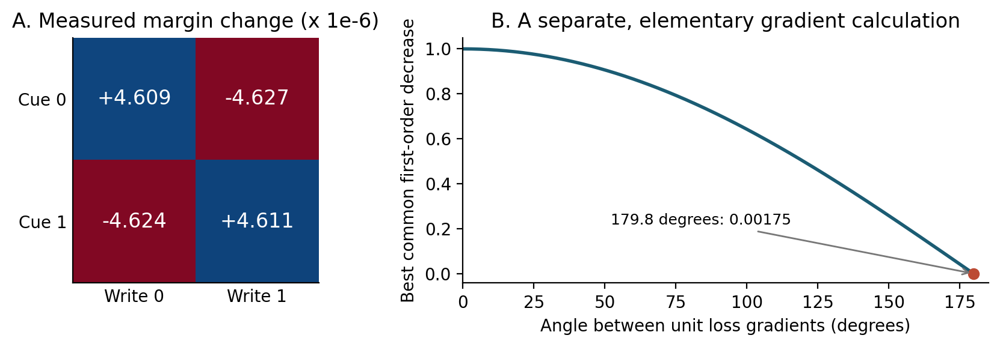

# When Should a Learner Split?

*Responsibility, interference, and evidence for structural specialization*

**Antti Luode**  
Independent research  
Research note, version 0.1 - 7 September 2026  
AI-assisted manuscript; not peer reviewed

## Abstract

An adaptive system encountering incompatible experience can modify an existing model, retrieve a different model, acquire additional evidence, or create a new model. These operations are easily conflated when prediction error, response strength, and plasticity share a control signal. We examine this distinction through a reproduced intervention diagnostic from a writable spatial medium and elementary counterexamples. Across twelve initializations, a rewarded write in the shared medium changes another cue's decision margin by approximately the same magnitude as its own; explicit separation removes this collateral effect by construction. However, such conflict does not establish that a new expert is needed. Opposing sample gradients arise under irreducible noise, gradient angles depend on coordinates, and selecting experts with the outcome being predicted can produce fictitious perfect performance. An action-conditioned sign process makes the timing failure explicit: causal prediction attains mean squared error 0.19046 under persistent contexts and 1.00000 under independent contexts, whereas an invalid outcome-selected rule reports zero in both. We formulate a diagnostic framework separating predictive responsibility, currently justified protection, and structural admission. We specify a prospective experiment for evaluating growth under bounded memory and paid observation. The contribution is a reproducible analysis of what would constitute evidence for useful specialization, rather than a new mixture-of-experts algorithm or a demonstrated growing agent.

**Keywords:** continual learning; structural plasticity; mixture of experts; active observation; interference; causal prediction

## 1. Introduction

Learning changes a system. Continual learning also requires deciding which existing knowledge should change. A surprising outcome can indicate a new situation, a familiar situation encountered again, an inaccurate model, a changed action mechanism, or unpredictable variation. Treating all these cases as instructions to rewrite the currently active representation can destroy useful knowledge. Treating all previously successful behavior as worth preserving can prevent necessary adaptation.

This problem arose repeatedly in a series of small computational experiments using persistent traces, addressable interventions, and writable spatial media. The most recent relevant sequence, JelloBrain, began with activity-dependent material changes and eventually measured how a write supporting one cue interfered with another [10]. Later experiments created additional storage bands when measured write effects opposed one another. They also tested writes on copies to reduce collateral changes. Neither intervention reliably solved a repeated contingency reversal. The technical question therefore moved beyond whether the system could store separate histories: how should experience select, revise, or expand the structures storing those histories?

Modular prediction and learning offer a well-established starting point. Mixtures of experts assign examples to specialized predictors [3]. Paired forward and inverse models use predictions of action consequences to assign responsibility to control modules [1]. Latent-cause theories distinguish modifying an old memory from forming another memory by inferring which cause generated the observations [2]. Dynamic expansion is also established in continual learning [4-6]. The absence of module birth in one early architecture does not establish an open gap in the subsequent literature.

This note makes a narrower contribution. First, it reproduces a finite intervention-effect measurement and separates it from stronger interpretations about representational capacity. Second, it gives analytic and executable controls for three confounds in growth claims: sample noise, coordinate dependence, and outcome leakage. Third, it specifies an evaluation contract in which growth must improve predictions made with available evidence while accounting for memory, observation, and interference costs. It does not report a new end-to-end learning architecture. Its empirical scope is one small substrate diagnostic and a deliberately elementary stochastic process.

## 2. Related work and the scope of the question

**Responsibility and specialization.** Jacobs et al. [3] established a learning procedure in which a gating system distributes cases among experts. Wolpert and Kawato [1] coupled forward predictors with inverse controllers; evidence about predicted consequences contributes to responsibility, which coordinates module use and learning. This is directly relevant to the difference between a strongly expressed response and a response justified by current evidence. The computational role of responsibility should not be confused with a claim about a specific anatomical implementation.

**Memory allocation and growth.** Gershman et al. [2] formulate memory modification as inference over latent causes: an observation assigned to an existing cause updates its associations, whereas a newly inferred cause can receive a new memory. Dynamically Expandable Networks selectively retrain, expand, and split units across tasks [4]. CURL combines task inference without task labels with expansion and rehearsal [5]. Jerfel et al. [6] use a Dirichlet-process mixture to handle changing latent task structure in meta-learning. Consequently, neither experience-dependent capacity nor an initially small expert collection is a novelty claim of this paper.

**Interference and protection.** Gradient Episodic Memory constrains updates using losses on stored experience [8]; PCGrad modifies conflicting task gradients [7]. These methods demonstrate that interference can motivate changes in optimization rather than necessarily requiring more modules. Their relationship to the present proposal is methodological: test whether a feasible update within the current representation suffices before interpreting conflict as an architectural deficiency. Protection also requires a choice of which historical distributions remain relevant to preserve.

**Sequential evaluation.** The distinction between assigning an explanation to a completed observation and predicting an observation before it arrives is fundamental. The prequential viewpoint evaluates sequential forecasts against their subsequent outcomes [9]. We apply that discipline to expert selection and structural admission. A new expert's ability to explain its training examples is not, by itself, evidence that it improves the next prediction.

## 3. A causal contract for modular learning

### 3.1 What is available when a decision is made?

At trial t, let H_t denote completed observations, issued actions, and retained internal state from earlier trials. Let x_t be the current cue available before action, u_t the issued action, and y_t its subsequently observed consequence. The environment may have an unobserved context z_t. Module k supplies a conditional predictive density p_k(y_t | x_t, u_t, H_t). The module's current parameters are fitted only from earlier evidence when this density is scored.

Two responsibility distributions have different information boundaries:

$$
q^-_{k,t}=P(z_t=k\mid H_t,x_t)
$$

$$
q^+_{k,t}=\frac{q^-_{k,t}\,p_k(y_t\mid x_t,u_t,H_t)}{\sum_j q^-_{j,t}\,p_j(y_t\mid x_t,u_t,H_t)}.
$$

The first can help select the current action or forecast. The second can assign a completed observation to a model, govern a subsequent parameter update, and influence the next decision. It cannot be used to revise the already scored current prediction. If a system purchases an intermediate observation before acting, that observation may legitimately update the prior, but its timing and acquisition cost must be recorded.

For a Gaussian observation model, the likelihood includes the residual covariance and its normalization, not just a raw residual norm. Covariance estimates must also respect the information boundary. Freely inflating uncertainty to explain everything, or shrinking it around completed observations, is not calibrated responsibility.

### 3.2 Relative responsibility is not absolute adequacy

Normalized responsibility must sum to one even if every candidate is wrong. For example, two scalar residuals of 100 and 101 with unit Gaussian variance and equal priors give the first model a posterior weight effectively equal to one, although its negative log likelihood is approximately 5000.92. Thus a confident winner can coexist with severe model failure.

A structural decision needs an adequacy check in addition to competition. Persistent poor predictive likelihood can nominate a model for investigation, but may reflect noise misspecification, missing observations, or an unsuitable feature representation. It does not determine whether to split, improve one model, or seek a more informative observation.

### 3.3 Protection must specify its scope

Let V_t be retained validation records. Each record identifies a past action, its observed consequence, the context evidence available at the time, and the representation under which the record is interpreted. For a proposed update d, define collateral loss on record i:

$$
B_i(d)=L_i(\theta+d)-L_i(\theta).
$$

Protection applies to explicitly stated conditional capabilities. A past action that succeeded under one external mapping is not thereby required to remain the current action after that mapping changes. Historical validity and current applicability are distinct. A practical approximation may weight protection by current evidence about those scopes, but the weights are uncertain estimates, not proofs that old behavior is safe or correct.

The central separation is therefore between three decisions: which model currently explains the evidence; which parameters may be revised without violating retained, scoped requirements; and whether additional structure has earned its cost. They can interact without being collapsed into a single error or confidence scalar.

## 4. Reproduced case: interference in a writable medium

### 4.1 Substrate and intervention protocol

JelloBrain is a discrete 16 by 16 excitable medium with four arrays of nonnegative directed nearest-neighbor material values. Fast excitation, refractoriness, and eligibility traces evolve locally; temporally ordered activity can deposit persistent material. Six fixed ports provide primitive pulses. The diagnostic uses two cue ports and two launcher ports. This is an engineered computational substrate, not a calibrated neuronal model [10].

We reran the upstream cross-write diagnostic without changing its source, pinned to commit 0141b091f7efda638feede6e9a4d8b15003e7af6. For each of twelve seeds, the shared condition receives 400 alternating rewarded writes per cue. The separated condition starts from two exact copies and supplies each cue its own band, with 400 writes per route. Thus the separated condition is an upper-bound control with supplied addressing and additional storage. It is not an equal-memory comparison or a demonstration of learned partitioning.

For cue i, the signed decision margin m_i is the response at its correct launcher minus the response at the other launcher under the fixed swapped mapping. Starting from the trained state, an independent copy receives exactly one additional ordinary rewarded write for cue j. The measured quantity is

$$
C_{ij}=m_i(\theta\ \mathrm{after\ write}\ j)-m_i(\theta).
$$

This is a finite write-effect matrix. It is not a derivative with respect to an unconstrained parameter, nor a matrix of loss gradients. Each column describes the consequence of a particular available write operation. Copies provide a counterfactual diagnostic here; their cost is not being offered as a biologically local mechanism.

### 4.2 Results

| Quantity | Shared sheet | Explicitly separated bands |
| --- | ---: | ---: |
| Mean pre-write correct margin | 0.00000858921 | 0.657988 |
| Mean absolute diagonal effect | 0.00000460986 | 0.00199538 |
| Mean absolute collateral effect | 0.00000462541 | 0 |
| Collateral / diagonal magnitude | 1.00337 | 0 |

**Table 1.** Reproduced means over twelve initializations. Absolute effects summarize magnitudes; the separated diagonal effects themselves are negative at this saturated operating point. Off-diagonal effects vanish exactly because the diagnostic writes and reads different independent bands. Neither storage nor trained operating point is matched between the columns.

The mean shared matrix, in units of one millionth of a margin, is:

| Readout | Write for cue 0 | Write for cue 1 |
| --- | ---: | ---: |
| Margin of cue 0 | +4.608601 | -4.626758 |
| Margin of cue 1 | -4.624059 | +4.611119 |

A rewarded write helps its own cue and harms the other by nearly the same amount. The angle between the two columns of this **mean effect matrix** is 179.807 degrees. This quantity should not be silently relabeled as the angle between parameter gradients. The coordinate system is the fixed pair of measured cue margins; changing the readout metric could change the angle.

The typical one-write effect is approximately half the already small shared decision margin. This explains why repeated writing is potentially disruptive in the tested state. It does not prove that the shared representation lacks a solution: the earlier construction achieves positive margins for both cues, and a different update family or operating point might behave differently. The reproduction establishes local collateral coupling for these writes, inputs, and parameters.

**Figure 1.** A: reproduced finite write effects in the shared medium. B: the separate first-order calculation in Section 5.1. The panels concern different mathematical objects; the gradient formula is not inferred from the medium's effect-vector angle.

### 4.3 What the later reversal reports establish

The pinned repository also contains later exploratory reports. They describe successful reversal with supplied cue-to-band addressing; imperfect reversal with anonymous competing bands; conflict-triggered band creation; and unsuccessful attempts to allocate writes by minimizing collateral changes on internal copies [10]. The copy-based allocator's reported middle-phase raw accuracy was 0.00, compared with 0.25 for random allocation. The reports identify protection of obsolete behavior as a failure mechanism. Those experiments are archived evidence in this note and were **not** rerun for this manuscript.

The anonymous-band selection rule uses the magnitude of a band's launcher preference. This is evidence about response strength, not a calibrated likelihood of current consequences. Later receipt and relevance variants partly address this distinction but do not yield a robust complete cycle. The reports therefore motivate responsibility-based selection; they do not demonstrate that adding such selection alone would solve the reversal task. Their small exploratory seed sets, successive design changes, and shared lineage also preclude treating them as independent confirmatory studies.

## 5. Why conflict is insufficient evidence for growth

### 5.1 Local opposition measures the difficulty of a shared update

Suppose two differentiable losses have nonzero, normalized gradients q_1 and q_2 at the current parameters, with angle alpha in a stated Euclidean parameter metric. For an update constrained by norm at most one, the largest simultaneous normalized first-order decrease is

$$
\max_{\|d\|_2\leq1}\min\{-q_1^Td,-q_2^Td\}=\cos(\alpha/2).
$$

**Proof.** The minimum of two numbers is at most their average. The objective is therefore at most the norm of (q_1+q_2)/2, which equals cos(alpha/2). When their sum is nonzero, choosing d opposite its normalized direction attains the bound for both losses. For exactly opposed gradients, d=0 attains zero and no positive common decrease is possible. This is a local first-order statement; curvature, step size, and other permissible changes remain outside it.

At 179.8 degrees, the best common normalized decrease is approximately 0.001745. Nearly opposite gradients therefore imply little common first-order progress per unit step in that metric. They do not imply that the function class is insufficient. The system may be near a sensible compromise, need a different feature, benefit from another optimization direction, or be responding to irreducible variability.

### 5.2 Counterexample: irreducible noise

Let observations be independent draws Y in {-1,+1}, equally likely, with no informative cue. A scalar predictor theta minimizes squared error. At theta=0, the gradients of the two half-squared sample losses are exactly opposite. Nevertheless,

$$
E[(\theta-Y)^2]=\theta^2+1
$$

is minimized by the existing predictor theta=0. Splitting into experts predicting -1 and +1 cannot improve pre-outcome squared error if their selector has the same uninformative history. More precisely, any possibly randomized forecast measurable from independent pre-outcome information has risk 1 plus its own second moment, and hence risk at least one.

A rule that assigns each completed observation to the expert matching its sign achieves zero retrospective error. That is an explanation of completed outcomes, not improved prediction. A mixture may still be useful for representing a non-Gaussian predictive density; the counterexample concerns the specified point-prediction objective and a claim of distinct, predictively selectable contexts. Opposed updates alone establish neither.

### 5.3 Counterexample: coordinate dependence

Consider gradients g_1=(1,2) and g_2=(1,-2). Their Euclidean cosine is -0.6. Under the invertible reparameterization theta=D phi with D=diag(3,1), the same losses have phi-gradients D-transpose g_1 and D-transpose g_2, whose cosine is 5/13, approximately +0.384615. The represented functions have not changed, yet the sign of the raw gradient conflict has.

Consequently, a gradient-angle trigger must declare its parameter metric and update rule. A finite consequence diagnostic can instead hold a physical intervention and its readouts fixed across reparameterizations. It remains conditional on those interventions, readouts, and their scaling. Neither diagnostic is an intrinsic count of how many concepts the world contains.

### 5.4 Counterexample: exact protection can preserve the wrong policy

A constraint that forbids changing a previously correct action also forbids adapting that action when its consequence reverses. More accurate counterfactual evaluation cannot repair a mistaken protection objective. The preserved object should be a conditional capability, such as behavior under a previously validated mapping, rather than an unconditional instruction to keep making the old choice now.

This is a logical limitation of the constraint, illustrated by the exploratory allocation failure in Section 4.3. It is not a newly established general explanation of catastrophic forgetting. It motivates recording the scope and provenance of retained requirements and testing their current applicability separately from their retention.

## 6. Executable timing control: persistent context versus noise

We constructed a process with issued actions u_t in {-1,+1}, hidden signs z_t in {-1,+1}, and observed consequences y_t=z_t u_t. The sign flips between trials with probability h. No context label is given before a prediction. Completed action and outcome pairs reveal the preceding sign exactly. The experiment compares h=0.05, where context persists, with h=0.5, where the current sign is independent of history. Both have the same symmetric one-trial marginal distribution in stationarity.

The two expert functions, f_-(u)=-u and f_+(u)=u, and the true transition probability h are supplied. These are information-bound controls, not learned models or a test of expert growth. With the previous sign inferred from completed evidence, the optimal squared-error forecast is

$$
\widehat y_t=(1-2h)\frac{y_{t-1}}{u_{t-1}}u_t,
\qquad E[(y_t-\widehat y_t)^2]=4h(1-h).
$$

Selecting the previous sign's expert without averaging has risk 4h. A constant-zero forecast has risk 1. A deliberately invalid selector choosing its expert after seeing y_t reports zero error. It is included only as a leakage control.

We ran 64 independent seeded streams per condition, each with 20,000 trials, omitting the initial trial from scoring. Conditions share random-number seeds for a paired design. All valid predictions are made before their scored outcome; the deliberately invalid control violates this boundary. Ninety-five percent intervals use the Student-t interval across the 64 stream means, not across dependent trials. No learning hyperparameters were fitted and no benchmark-selection claim is made.

| Rule | h=0.05: mean MSE [95% CI] | h=0.50: mean MSE [95% CI] |
| --- | --- | --- |
| Constant zero | 1.00000 [1.00000, 1.00000] | 1.00000 [1.00000, 1.00000] |
| Causal known-model mixture | 0.19046 [0.18909, 0.19182] | 1.00000 [1.00000, 1.00000] |
| Previous-context expert | 0.20051 [0.19899, 0.20202] | 1.99910 [1.99534, 2.00287] |
| Outcome-selected expert: INVALID | 0.00000 [0.00000, 0.00000] | 0.00000 [0.00000, 0.00000] |

**Table 2.** New simulations of the analytic timing control. Exact causal-mixture risks are 0.19 and 1.00. Degenerate intervals reflect exactly constant sample errors. The invalid row cannot be interpreted as forecasting performance.

**Figure 2.** The same expert bank has different predictive value depending on information available before the outcome. Error bars are 95% intervals across seed means. Zero-height red bars are the deliberately invalid retrospective selector.

The sample gradient at theta=0 for a single linear predictor is -u_t y_t=-z_t. The fraction of consecutive gradients that are exactly opposed is therefore h: measured rates were 0.05013 for persistent contexts and 0.49978 for independent contexts. A naive conflict detector would flag the unpredictable condition roughly ten times as often. This is not a measured false-birth rate for a learning algorithm; no modules are born in this experiment. It is a counterexample to interpreting conflict frequency as sufficient evidence for useful context specialization.

A single recurrent predictor could implement the optimal forecast using a retained sign and a transition model. Thus even predictive context structure does not imply that multiple experts are the uniquely appropriate architecture. Any module-count claim must be relative to a specified model family and resource budget.

## 7. A prospective test of structural admission

### 7.1 A candidate decision rule

The preceding results motivate a testable proposal rather than an implemented method. An incumbent module first predicts the next acquired consequence. Inadequate prediction triggers diagnosis: compare retained models, inspect whether additional observation resolves ambiguity, and test whether an update within the existing representation satisfies currently justified preservation requirements. Persistent residual error and harmful intervention effects can nominate a split for evaluation.

Nomination must be separated from admission. A candidate split is fitted on one bounded history segment and then compared with a matched nonsplitting alternative on subsequent predictions. For a prespecified evaluation window W, define its predictive advantage

$$
G_W=\sum_{t\in W}\left[\log p_{\mathrm{split},t}(y_t)-\log p_{\mathrm{shared},t}(y_t)\right].
$$

Each density is fixed before its outcome arrives; both models may update afterward under the same declared rules. Admit additional structure only if its advantage exceeds a declared cost penalty and it meets retained conditional performance constraints. This is a proposal for empirical model comparison, not a calibrated significance test or a universal optimal-growth theorem. Reusing a window across many candidate splits requires explicit accounting for selection. A disjoint audit stream, sequential testing procedure, or prospectively fixed candidate budget would be needed for stronger error control.

The complexity penalty must include candidate fitting, extra predictive evaluations, stored evidence, and later routing costs. A copy that temporarily doubles the available substrate is real resource use even if discarded. Similarly, a perfectly informed validator is not free. A useful stopping decision is to reject growth when uncertainty cannot be resolved within the available evidence budget.

### 7.2 Proposed world and comparison set

The accompanying protocol specifies a small action-conditioned environment: an agent chooses a bounded two-dimensional probe and one scalar readout of an unknown linear response map. Three response maps recur in unannounced blocks. The stream also includes noisy familiar conditions, smoothly changing conditions, and a stationary nonlinear control for which enriching one model is a plausible alternative to splitting. Hidden labels and change times are reserved for retrospective scoring.

The growing learners start with one active predictor. All learners face an explicit total memory ceiling. Additional expert arrays, optimizer state, traces, candidate copies, and transition estimates all count. An unlimited-memory oracle may be displayed separately as an upper bound. The comparison set includes a single adaptive predictor, a fixed expert bank with causal responsibility, a growing bank triggered by prediction error, a growing bank nominated by measured conflict and admitted by prospective evidence, and a compact recurrent predictor. These baselines are specifications for future implementation, not algorithms evaluated in this note.

Growth is useful only if it improves the joint trade-off. The evaluation should report pre-outcome error, acquisition cost, peak and persistent memory, unnecessary allocations on stationary-noise controls, interference with retained conditional capabilities, and recovery when a familiar condition returns. It should also report evidence required after an unannounced switch: perfect immediate recovery is not a legitimate target when available histories leave contexts indistinguishable.

### 7.3 What would count as progress?

A compelling result would show that one homogeneous initial representation develops reusable specializations; selection transfers back when a familiar condition returns; growth stays bounded under unpredictable noise; and the gains survive equal-budget nonsplitting competitors. The benefit should persist under new seeds, changed dwell times, altered noise levels, and relabeling of anonymous internal modules. A gradient or interference threshold alone would not establish this result.

For a spatial implementation, the additional burden is to show where the selection state and learned partition live. If an external lookup table contains the effective solution while the material merely displays it, the system has demonstrated a controller with a visualization. Conversely, erasing legitimate context state before evaluation would unfairly remove information the running system needs. Evaluation should distinguish an intervention testing material storage from an intervention testing the complete agent; these are different claims.

## 8. Discussion and limitations

The motivating intuition was that experience might change the decomposition of a computational system, in addition to its numerical parameters. The literature already establishes several forms of this idea. The unresolved local challenge in the inspected substrate is to make specialization selectable and revisable through the system's own evidence, while preserving useful conditional knowledge and paying for the observations and memory used to do so.

The contribution of this note is primarily diagnostic. We reproduce one intervention matrix, clarify why its interpretation is narrower than a capacity theorem, and provide controls that an architectural growth claim should survive. The angle calculation, conditional-expectation bound, and coordinate counterexample are elementary; we do not claim them as new mathematical discoveries. The timing experiment uses known experts and known transition probabilities. It validates an information boundary, not learned inference. The wider reversal reports are retrospective and exploratory. No biological measurements, acoustic hardware validation, or large-scale machine-learning benchmarks are supplied.

Predictive responsibility is also not sufficient by itself. Competing models can be jointly wrong; misspecified uncertainty can distort their relative scores; silent changes can remain undetectable between observations; and a learned sampling policy can avoid evidence that would challenge it. An audit allocation independent of the incumbent's preferred explanation is therefore an important prospective control. The exact amount and value of such auditing must be measured rather than assumed.

A functional account of self-generated consequences does not establish subjective experience. Nor does physical-looking growth establish a computational advantage over an ordinary state-space or recurrent model. The relevant question here is operational: does structural change improve what the system can predict, preserve, and reacquire under its actual evidence and resource constraints?

The next result should demonstrate a complete cycle of selection, revision, and reuse with a justified admission of new structure. Until that cycle is measured in this substrate, the proposed conflict-driven growth mechanism remains a hypothesis, and the strongest deliverable is an experiment that can reject it for the right reasons.

## Reproducibility and provenance

The public repository is [github.com/anttiluode/Paper](https://github.com/anttiluode/Paper). It contains this manuscript, the PDF generation script, figures, all newly generated numerical receipts, an unchanged minimal snapshot of the upstream diagnostic with its license, and a SHA-256 source manifest. Running `python vendor/jellobrain/crosstalk_probe.py` reproduces the substrate diagnostic. Running `python analysis/run_analysis.py` regenerates the numerical controls and figures; `python analysis/check.py` verifies source integrity, causal timing, the independent numerical gradient bound, and receipt consistency. Full commands appear in the repository README.

The manuscript was developed from author-supplied discussions with ChatGPT systems referred to as Sol and Astra. ChatGPT assisted with literature retrieval, synthesis, mathematical exposition, code, execution, and typesetting. AI systems are not listed as authors. The text is an author-directed research draft requiring human review before formal submission. No external peer review, institutional affiliation, or independent replication is implied. The private conversation transcript is not included in the public repository. The repository's existing MIT license is retained.

## References

[1] Wolpert, D. M., and Kawato, M. (1998). Multiple paired forward and inverse models for motor control. *Neural Networks*, 11(7-8), 1317-1329. [doi:10.1016/S0893-6080(98)00066-5](https://doi.org/10.1016/S0893-6080(98)00066-5).

[2] Gershman, S. J., Monfils, M.-H., Norman, K. A., and Niv, Y. (2017). The computational nature of memory modification. *eLife*, 6, e23763. Corrected version of record. [doi:10.7554/eLife.23763](https://doi.org/10.7554/eLife.23763).

[3] Jacobs, R. A., Jordan, M. I., Nowlan, S. J., and Hinton, G. E. (1991). Adaptive mixtures of local experts. *Neural Computation*, 3(1), 79-87. [doi:10.1162/neco.1991.3.1.79](https://doi.org/10.1162/neco.1991.3.1.79).

[4] Yoon, J., Yang, E., Lee, J., and Hwang, S. J. (2018). Lifelong learning with dynamically expandable networks. *International Conference on Learning Representations*. [arXiv:1708.01547](https://arxiv.org/abs/1708.01547).

[5] Rao, D., Visin, F., Rusu, A. A., Teh, Y. W., Pascanu, R., and Hadsell, R. (2019). Continual unsupervised representation learning. *Advances in Neural Information Processing Systems*, 32. [Proceedings](https://proceedings.neurips.cc/paper/2019/hash/861578d797aeb0634f77aff3f488cca2-Abstract.html).

[6] Jerfel, G., Grant, E., Griffiths, T. L., and Heller, K. (2019). Reconciling meta-learning and continual learning with online mixtures of tasks. *Advances in Neural Information Processing Systems*, 32. [Proceedings](https://proceedings.neurips.cc/paper/2019/hash/7a9a322cbe0d06a98667fdc5160dc6f8-Abstract.html).

[7] Yu, T., Kumar, S., Gupta, A., Levine, S., Hausman, K., and Finn, C. (2020). Gradient surgery for multi-task learning. *Advances in Neural Information Processing Systems*, 33. [arXiv:2001.06782](https://arxiv.org/abs/2001.06782).

[8] Lopez-Paz, D., and Ranzato, M. (2017). Gradient episodic memory for continual learning. *Advances in Neural Information Processing Systems*, 30. [arXiv:1706.08840](https://arxiv.org/abs/1706.08840).

[9] Dawid, A. P. (1984). Present position and potential developments: Some personal views. Statistical theory: The prequential approach. *Journal of the Royal Statistical Society, Series A*, 147(2), 278-292. [doi:10.2307/2981683](https://doi.org/10.2307/2981683).

[10] Luode, A. (2026). JelloBrain: software and exploratory experiment reports. GitHub repository, commit 0141b091f7efda638feede6e9a4d8b15003e7af6, accessed 7 September 2026. [Pinned source](https://github.com/anttiluode/JelloBrain/tree/0141b091f7efda638feede6e9a4d8b15003e7af6). This is an AI-assisted project in the same research lineage, not an independent validation.
